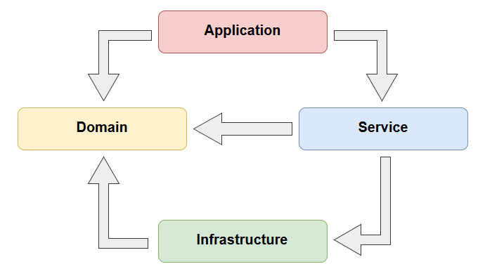

# APImanager 
Projeto desenvolvendo uma API por camadas:

`Camada de Aplicação:` Exposição da aplicação ao público. Aqui são desenvolvidos os controladores, que recebem todas as requisições e as direcionam a algum serviço para executar uma determinada ação.

`Camada de Dominio:` Entidades (bem como seus métodos, comportamentos e propriedades) da aplicação.

`Camada de Serviços:` Define as regras de negócio.

`Camada de Infraestrutura:` lida com persistência no banco de dados.

> ### Conteúdo Abordado

| O que foi visto? |
| ---------------------------- |
| Arquitetura em camadas       |
| <a href="src/Manager.API/Startup.cs"> Injeção de dependência </a>    |
| <a href="src/Manager.Infra/Context/ManagerContext.cs"> Acesso a dados: Entity Framework Core </a>    |
| <a href="src/Manager.Infra/Mappings/UserMap.cs">Mapeamento DB com Entity framework core</a> |
| <a href="src/Manager.Domain/Validators/UserValidator.cs"> Fluent Validation </a> |
| <a href="src/Manager.Infra/Repositories"> Repository Pattern   </a> |
| <a href="src/Manager.Services/Services/UserService.cs"> AutoMapper : DTO </a>    |
| <a href=" "> tópico </a>    |

## 
| Comandos | Execução | Docs | Comentários |
| ------ | ------- | ------- | -----------| 
| dotnet ef migrations add 'NomeDaMigration' | cli .net   | <a href="https://docs.microsoft.com/pt-br/ef/core/managing-schemas/migrations/?tabs=dotnet-core-cli"> Microsoft : Visão geral das migrações  </a>   |  ----   |
| dotnet ef database update    | cli .net  | <a href="https://docs.microsoft.com/pt-br/ef/core/managing-schemas/migrations/?tabs=dotnet-core-cli"> Microsoft : Visão geral das migrações </a> |   ----      |
| dotnet user-secrets         |  cli .net  | <a href="https://docs.microsoft.com/pt-br/aspnet/core/security/app-secrets?view=aspnetcore-6.0&tabs=windows"> Microsoft : segredos de aplicativo no desenvolvimento </a>  | ----   |
| dotnet user-secrets set "ConnectionStrings:NOMECONEXAO" "Server = localhost,1433; Database=managerAPI; User ID=****; password=**** ;TrustServerCertificate=True" | cli .net |  ----  | retirando string de conexão da aplicação (cód fonte) e estabelecendo-a como segredo de aplicação | 

